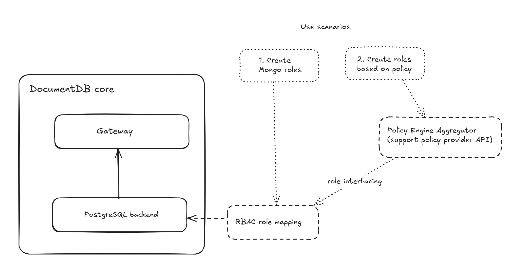

# Role Based Access Control (RBAC) in DocumentDB

In this document, we present a comprehensive design for implementing Role-Based Access Control (RBAC) in [DocumentDB](https://learn.microsoft.com/en-us/azure/cosmos-db/mongodb/vcore/oss),
aimed at enhancing security and manageability. This design outlines the initial features to be delivered to customers, with
future enhancements detailed in the Appendix. Our approach includes the flexibility to disable the built-in RBAC engine and
integrate alternative solutions, ensuring adaptability to various security requirements.

In a nutshell, the RBAC design includes 2 parts: 

- *Role mapping*: for compatibility, corresponding roles are created and implemented in the backend which allows for 
previlege actions. As a baseline, the specifications around role mapping takes up most of this document.

- *Integrating with policy engines*: while role mapping essentially delegates the fundamental security to the database (DB) backend,
we also would like to incorporate organizational policies towards a secure, scalable, and standardized authorization mechanism,
as well as fostering interoperability.

### Table of Contents

- [Role Mapping](#role-mapping)
  - [Built-In roles](#built-in-roles)
    - [Detailed definition for DocumentDB roles](#detailed-definition-for-documentdb-roles)
    - [Integration Testing with Other Features](#integration-testing-with-other-features)
  - [Custom Roles](#custom-roles)
    - [CreateRole](#createrole)
    - [dropRole](#droprole)
    - [updateRole](#updaterole)
    - [rolesInfo](#rolesinfo)
  - [User CRUD API changes](#user-crud-api-changes)
    - [UpdateUser](#updateuser)
  - [Compatible Privilege Actions](#compatible-privilege-actions)
    - [How do we store comptable databases and collections in the backend](#how-do-we-store-compatible-databases-and-collections-in-the-backend)
    - [Collection level access control](#collection-level-access-control)
      - [Find](#find)
      - [Insert](#insert)
      - [Update](#update)
      - [Remove](#remove)
  - [User/Role CRUD RBAC](#userrole-crud-rbac)
    - [CreateRole and CreateUser](#createrole-and-createuser)
    - [UpdateRole and UpdateUser, DropRole and DropUser, GrantRole and RevokeRole across all databases](#updaterole-and-updateuser-droprole-and-dropuser-grantrole-and-revokerole-across-all-databases)
- [Integrating with other policy engines](#integrating-with-other-policy-engines)
- [APPENDIX](#appendix)
  - [Collection Level Access Control with the ability to only execute required functions](#collection-level-access-control-with-the-ability-to-only-execute-required-functions)
  - [Additional Built-In Roles we will support in future phases](#additional-built-in-roles-we-will-support-in-future-phases)
  - [Built-In roles not planned for support](#built-in-roles-not-planned-for-support)
  - [Additional privileges we will support in future phases](#additional-privileges-we-will-support-in-future-phases)
  - [Privileges not planned for support](#privileges-not-planned-for-support)
  - [Privileges with DocumentDB backend incompatibility](#privileges-with-DocumentDB-backend-incompatibility)
  - [DB level access control Find, Insert, Update, Remove](#database-level-access-control-find-insert-update-remove-after-migrating-to-a-new-data-model-where-pg-schema--compatible-db)
  - [CreateCollection](#createcollection)
    - [Database level](#database-level)
    - [Collection level](#collection-level)
  - [DropCollection](#dropcollection)
    - [DropCollection at Database level](#dropcollection-at-database-level)
    - [DropCollection at Collection level](#dropcollection-at-collection-level)
  - [ListCollections](#listcollections)
  - [Users per DB](#users-per-db)
  - [Grant/Revoke roles to user](#grantrevoke-roles-to-user)
    - [Grant roles to user](#grant-roles-to-user)
    - [Revoking roles](#revoking-roles)
  - [Role Management API support in future phases](#role-management-api-support-in-future-phases)
    - [dropAllRolesFromDatabase](#dropallrolesfromdatabase)
    - [grantPrivilegesToRole](#grantprivilegestorole)
    - [grantRolesToRole](#grantrolestorole)
    - [revokePrivilegesFromRole](#revokeprivilegesfromrole)
    - [revokeRolesFromRole](#revokerolesfromrole)

## Role Mapping
Role mapping is the process of translating the compatible database's role-based access control (RBAC) system to PostgreSQL (PG)'s role and privilege system. Since the compatible database (CDB) and PG have different role models and privilege structures, we need to map those compatible roles and their associated privileges to equivalent PG roles and permissions.

This mapping ensures that:
- Users can authenticate and receive appropriate permissions in the PG backend
- Role semantics with regard to CDB are preserved while leveraging PG's native security features
- Administrative operations in CDB (like user management) properly translate to PG role operations
- Built-in CDB roles (like `readAnyDatabase`, `readWriteAnyDatabase`) have corresponding DocumentDB roles with equivalent capabilities

The following sections detail how specific compatible roles are mapped to DocumentDB/PG roles, including any differences in supported privileges. In addition, the Appendix section contains what will be implemented in later phases, as well as earlier designs we considered but abandoned.

### Built-In roles

**Note: We only support privileges for which the corresponding commands are supported by DocumentDB. For a list of privileges we cannot support
since the corresponding commands are not supported by documentDB please see [Privileges with DocumentDB backend incompatibility](#privileges-with-documentdb-backend-incompatibility). None of these privileges are supported for any of the roles below.**                                                                                                                                 
#### Detailed definition for DocumentDB roles

##### documentdb_readonly_role

This is an existing role that inherits from pg_read_all_data and can perform read operations across all databases.

We need to add support for killCursors privilege to documentdb_readonly_role.

##### documentdb_readwrite_role

Currently, customer has to provision readWriteAnyDatabase and clusterAdmin roles together.
Going forward, we'll let customer provision readWriteAnyDatabase role alone.
Internally this is represented by the documentdb_readwrite_role and inherits from {pg_read_all_data, pg_write_all_data}.

We need to explicitly block this role from accessing these commands:

1. dropDatabase
2. collMod
3. compact
4. reindex
5. validate
6. bypassDocumentValidation
7. indexStats
8. enableSharding
9. shardCollection
10. reshardCollection
11. addShard
12. removeShard
13. listShards
14. getShardMap

##### documentdb_user_admin_role

This role will have the CREATEROLE privilege. In addition we will grant it ADMIN privileges on all users (ROLE WITH LOGIN) in the system.
We will create a new PG role called documentdb_user_admin_role and do the following

1. We will grant CREATEROLE privileges to documentdb_user_admin_role. This will allow documentdb_user_admin_role to create new roles.
2. We will grant admin privileges on all existing and future users to documentdb_user_admin_role. This will allow documentdb_user_admin_role
to Update and Delete all users in the system.
3. We will grant access to the documentdb_api schema and read access on the documentdb_catalog.collections table so that documentdb_user_admin_role
can call listDatabases.

##### documentdb_admin_role

This role corresponds to {readWriteAnyDatabase, clusterAdmin}, which exists today.
Eventually we want to move away from this role and have two separate roles documentdb_readwrite_role and documentdb_cluster_admin_role.

##### documentdb_root_role

The upper-level system has limitations in setting roles from azure_pg_admin.
In order to set documentdb_root_role internally we need to wait until setting roles is allowed via their respective Admin
endpoint.

This role will have root privileges in our system.

We need to backfill all existing clusters to make the default admin users inherit from root_role.

#### Integration Testing with Other Features

We will test to ensure the feature is compatible with each of these.

- PITR
- Geo Replica
- MX
- Data API

### Custom Roles

Unlike the CDB which supports both Users and Roles, PG only supports Roles. Users in PG are Roles with LOGIN privilege.

1. createRole
2. dropRole
3. updateRole
4. rolesInfo

#### CreateRole

```json
db.runCommand(
   {
     createRole: "customRoleName",
     privileges: [
       { resource: { db: "dbName", collection: "collectionName" }, actions: [ "action", ... ] },
       ...
     ],
     roles: [
       { role: "roleName", db: "dbName" } | "role",
       ...
     ]
   }
)
```

- We will only support the parameters *createRole*, *roles* and *privileges*.
- We will not support *authenticationRestrictions*, *writeConcern*, *comment*.

```json
use users
db.runCommand({ createRole: "myClusterwideAdmin",
  privileges: [
    { resource: { db: "users", collection: "usersCollection" }, actions: [ "update", "insert", "remove" ] },
  ],
  roles: [
    { role: "readAnyDatabase", db: "admin" }
  ]
})
```

#### dropRole

```json
db.runCommand(
   {
     dropRole: "role"
   }
)
```

- We will only support the parameter *dropRole*.
- We will not support *writeConcern* and *comment*.
- Even a role that is currently being inherited by other roles/users can be dropped, and any privileges inherited are lost when the parent role is dropped.

```json
use products
db.runCommand(
   {
     dropRole: "readPrices"
   }
)
```

#### updateRole


``` json
db.runCommand(
   {
     updateRole: "<role>",
     privileges:
         [
           { resource: { <resource> }, actions: [ "<action>", ... ] },
           ...
         ],
     roles:
         [
           { role: "<role>", db: "<database>" } | "<role>",
           ...
         ]
   }
 )
```

We will only support the parameters *updateRole*, *roles* and *privileges*. We will not support the parameters *roles*, *authenticationRestrictions*, 
*writeConcern* and *comment*.

```json
db.adminCommand(
   {
     updateRole: "myClusterwideAdmin",
     privileges:
         [
           {
             resource: { db: "", collection: "" },
             actions: [ "find" , "update", "insert", "remove" ]
           }
         ],
     roles:
         [
           { role: "dbAdminAnyDatabase", db: "admin" }
         ]
   }
)
```

#### rolesInfo

We'll scope down the output to whatever we can reconstruct from PG roles info.

```json
db.runCommand(
   {
     rolesInfo: { role: "roleName", db: "dbName" },
     showPrivileges: "true/false",
   }
)
```

We will only support the *rolesInfo* parameter. We will not support *showAuthenticationRestrictions* and *comment*. We will only allow "true" for *showPrivileges* and *showBuiltinRoles*.

```json
db.runCommand(
    {
      rolesInfo: 1,
      showPrivileges: true
    }
)
```

Sample output

```json
{
  roles: [
    {
      _id: "products.associate",
      role: "associate",
      db: "products",
      privileges: [
        {
          resource: { db: "products", collection: "" },
          actions: [ "bypassDocumentValidation" ]
        }
      ],
      roles: [ { role: "readWrite", db: "products" } ],
      isBuiltin: false,
      inheritedRoles: [ { role: "readWrite", db: "products" } ],
      inheritedPrivileges: [
        {
          resource: { db: "products", collection: "" },
          actions: [ "bypassDocumentValidation" ]
        },
        {
          resource: { db: "products", collection: "" },
          actions: [
            "changeStream",
            "collStats",
            "compactStructuredEncryptionData",
            ...
          ]
        },
        ...
      ]
    }
  ],
  ok: 1
}
```

### User CRUD (Create, Read, Update and Delete) API changes

For all DocumentDB users, we will create ROLE WITH LOGIN in PG, which is currently in place.

#### UpdateUser

``` json
 db.runCommand(
    {
      updateUser: "userName",
      pwd: passwordPrompt(),      // Or  "<cleartext password>"
      roles: [
        { role: "roleName", db: "dbName" } | "roleName",
        ...
      ]
    }
)
```

```json
use products
db.runCommand( {
   updateUser : "appClient01",
   roles : [ { role : "read"} ]
} )
```

### Compatible Privilege Actions

| Privilege Action | Collection | Database                                                                     | Cluster |
|------------------|------------|------------------------------------------------------------------------------|---------|
| find             | Supported  | Will be supported in the future                                              | N/A     |
| insert           | Supported  | Will be supported in the future                                              | N/A     |
| remove           | Supported  | Will be supported in the future                                              | N/A     |
| update           | Supported  | Will be supported in the future                                              | N/A     |
| createUser       | N/A        | For now, only supported for all databases, cannot scope to specific database | N/A     |
| dropUser         | N/A        | For now, only supported for all databases, cannot scope to specific database | N/A     |
| updateUser       | N/A        | For now, only supported for all databases, cannot scope to specific database | N/A     |
| createRole       | N/A        | For now, only supported for all databases, cannot scope to specific database | N/A     |
| dropRole         | N/A        | For now, only supported for all databases, cannot scope to specific database | N/A     |
| grantRole        | N/A        | For now, only supported for all databases, cannot scope to specific database | N/A     |
| revokeRole       | N/A        | For now, only supported for all databases, cannot scope to specific database | N/A     |

#### How do we store compatible databases and collections in the backend

To implement full RBAC, we need to understand how we store compatible databases and collections in the backend (which talks in terms of tables). We achieve this with the aid of the documentdb_catalog.collections table.

postgres=# select * from collections;

|database_name | collection_name | collection_id | shard_key             | collection_uuid                     |
|--------------|-----------------|---------------|-----------------------|-------------------------------------|
|db1           | Collection1     | 1             |                       | c40f03f2-ecb2-452d-b4da-3286c6eeb9d7|
|db1           | Collection2     | 2             | { "item" : "hashed" } | c7384f6e-48a0-4573-a073-2314d6bc3a58|
|db2           | Collection3     | 3             | { "item" : "hashed" } | c7384f6e-48a0-4573-a073-2314d6bc3a58|

#### Collection level access control

For all privilges below we need to

1. GRANT USAGE ON SCHEMA documentdb_api, documentdb_catalog, documentdb_api_v1, documentdb_core, documentdb_data TO userName.
2. If we have a collection that's sharded across multiple nodes we need to run the function grant operations within *run_command_on_worker*

In addition we need to do the following for the specific roles

##### Find

- GRANT SELECT ON TABLE documentdb_data.documents_collectionId TO userName.

##### Insert

- GRANT INSERT ON TABLE documentdb_data.documents_collectionId TO userName.
- In case Insert would result in a new collection being created the command will fail since the role will not have INSERT privileges on documentdb_catalog.collections

##### Update

- GRANT SELECT, UPDATE ON TABLE documentdb_data.documents_collectionId TO userName.

##### Remove

- GRANT SELECT, DELETE ON TABLE documentdb_data.documents_collectionId TO userName.

#### User/Role CRUD RBAC

In the backend any user that can CREATE ROLE can also CREATE ROLE WITH LOGIN. We will not support per database users/roles. Any role/user created will apply to all databases.

For all the privileges below we need to

- GRANT USAGE ON SCHEMA documentdb_api, documentdb_catalog, documentdb_api_v1, documentdb_core, documentdb_data TO userName.

#### CreateRole and CreateUser

 There is no way to grant one privilege and withhold the other. So we can only grant/revoke CreateRole and CreateUser together using the CREATEROLE privilege in PG.

#### UpdateRole and UpdateUser, DropRole and DropUser, GrantRole and RevokeRole across all databases

In PG, in order to drop/alter/update another role one of these sets of conditions must be met. And these privileges come together as a set, PG does not let us speparate these.

The user must be a PG SUPERUSER

OR

The user must have CREATEROLE privilege and must have created the target ROLE

OR

The user must have CREATEROLE privilege and must have ADMIN privileges on the target ROLE

We will create a new role *documentdb_user_admin_any_database_role* which will be granted ADMIN option on every role/user created and will also have the CREATE ROLE privilege.
Any user who needs to have the ability to DropRole, DropUser, GrantRole and RevokeRole on roles other than the ones they create need to be granted UserAdminAnyDatabase.

## Integrating with other policy engines

In future phases, we will build in the support to integrate with other policy engines such as Azure Purview. In order to do this, we will need to add support for the following

1. Create roles based on Policy
2. Policy Engine Aggregator
3. A translation layer that can translate these policy based roles into native PG roles



As the above flowchart shows, the implementation depends on the completion of role mapping and more details should follow when the
roles and priviledges progress further.

## APPENDIX

### Collection Level Access Control with the ability to only execute required functions

Today the ability to execute all our functions in all our schemas is granted to PUBLIC. This means as soon as a user is granted USAGE on a schema they can execute all the functions in that schema. We need to make the following changes

1. Only grant admin_role and root (which we will assign to the user created when a new cluster is provisioned) the ability to run all functions in all schemas.
2. Revoke the privilege to execute functions in all schemas from all other roles
3. Grant readonly_role only the ability to run read top level functions, and any functions that these top level functions rely on. (Optionally we can just grant everything to readonly_role just like in 1 to avoid regressions)
4. Change default privileges to revoke execute on all functions from PUBLIC and grant execute on all functions to admin_role and root.
5. For each role below only grant execute on the top level functions corresponding to the privilege and any functions called by these top level functions. Any breaking changes here will be caught by tests.

#### Find

1. GRANT EXECUTE ON documentdb_api.aggregate_cursor_first_page, documentdb_api.find_cursor_first_page, documentdb_api.cursor_get_more in the documentdb_api schema.
2. GRANT USAGE ON SCHEMA documentdb_api, documentdb_catalog, documentdb_api_v1, documentdb_core, documentdb_data TO find_role. We will need to grant execute on other internal functions as needed.
3. GRANT SELECT ON TABLE documentdb_data.documents_collectionId TO find_role
4. If we have a collection that's sharded across multiple nodes we need to run the function grant operations within *run_command_on_worker*

#### Insert

1. GRANT EXECUTE ON documentdb_api.insert, documentdb_api.insert_bulk, documentdb_api.insert_one to find_role.
2. GRANT INSERT ON TABLE documentdb_data.documents_collectionId TO find_role.
3. GRANT USAGE ON SCHEMA documentdb_api, documentdb_catalog, documentdb_api_v1, documentdb_core, documentdb_data TO find_role. We will need to grant execute on other internal functions as needed.
4. In case Insert would result in a new collection being created the command will fail since the role will not have INSERT privileges on documentdb_catalog.collections
5. If we have a collection that's sharded across multiple nodes we need to run the function grant operations within *run_command_on_worker*

#### Update

1. GRANT EXECUTE ON documentdb_api.find_and_modify, documentdb_api.update, documentdb_api.update_bulk to find_role.
2. GRANT UPDATE ON TABLE documentdb_data.documents_collectionId TO find_role.
3. GRANT USAGE ON SCHEMA documentdb_api, documentdb_catalog, documentdb_api_v1, documentdb_core, documentdb_data TO find_role. We will need to grant execute on other internal functions as needed.
4. If we have a collection that's sharded across multiple nodes we need to run the function grant operations within *run_command_on_worker*

#### Remove

1. GRANT EXECUTE ON documentdb_api.delete to find_role.
2. GRANT DELETE ON TABLE documentdb_data.documents_collectionId TO find_role.
3. GRANT USAGE ON SCHEMA documentdb_api, documentdb_catalog, documentdb_api_v1, documentdb_core, documentdb_data TO find_role. We will need to grant execute on other internal functions as needed.
4. If we have a collection that's sharded across multiple nodes we need to run the schema grant operations within *run_command_on_worker*

### Additional Built-In Roles we will support in future phases

| Role               | Scope    |
|--------------------|----------|
| read               | database |
| readWrite          | database |
| dbAdmin            | database |
| dbAdminAnyDatabase | cluster  |
| dbOwner            | database |
| userAdmin          | database |
| root               | cluster  |
| clusterAdmin       | cluster  |

### Built-In roles not planned for support

| Role                  | Scope    |
|-----------------------|----------|
| clusterManager        | cluster  |
|                       |          |
| clusterMonitor        | cluster  |
| __system              | cluster  |
| directShardOperations | cluster  |
| enableSharding        | cluster  |
| hostManager           | cluster  |
| backup                | cluster  |
| restore               | cluster  |

### Additional privileges we will support in future phases

| Privilege           | Scope                       |
|---------------------|-----------------------------|
| find                | database                    |
| insert              | database                    |
| remove              | database                    |
| update              | database                    |
| createCollection    | database                    |
| dropCollection      | database                    |
| listCollections     | database                    |
| listIndexes         | database/collection         |
| createIndex         | database/collection         |
| reIndex             | database/collection         |
| createSearchIndexes | database/collection         |
| dropSearchIndex     | database/collection         |
| dropDatabase        | database                    |
| dropIndex           | database/collection         |
| enableSharding      | cluster/database/collection |
| reshardCollection   | database/collection         |
| addShard            | cluster                     |

### Privileges not planned for support

Add a comments column about why we're not supporting them.

| Privilege                           | Scope                                  | Reason                              |
|-------------------------------------|----------------------------------------|-------------------------------------|
| listSearchIndexes                   | database/collection                    |                                     |
| collStats                           | database/collection                    |                                     |
| dbStats                             | database                               |                                     |
| changeCustomData                    | database                               |                                     |
| changeOwnCustomData                 | database                               |                                     |
| getDefaultRWConcern                 | cluster                                |                                     |
| getParameter                        | cluster                                |                                     |
| killCursors                         | Users can always kill their own cursor |                                     |
| killAnyCursor                       | collection                             |                                     |
| getShardMap                         | cluster                                |                                     |
| listShards                          | cluster                                |                                     |
| killop                              | cluster                                |                                     |
| removeShard                         | cluster                                |                                     |
| collMod                             | database/collection                    |                                     |
| serverStatus                        | cluster                                |                                     |
| getLog                              | cluster                                |                                     |
| indexStats                          | database/collection                    |                                     |
| setFeatureCompatibilityVersion      | cluster                                |                                     |
| appendOplogNote                     | cluster                                |                                     |
| replSetHeartbeat                    | cluster                                |                                     |
| compact                             | database/collection                    |                                     |
| compactStructuredEncryptionData     | database/collection                    |                                     |
| connPoolSync                        | cluster                                |                                     |
| convertToCapped                     | database/collection                    |                                     |
| dropConnections                     | cluster                                |                                     |
| fsync                               | cluster                                |                                     |
| anyAction                           | Do not assign this action unless       |                                     |
|                                     | it is absolutely necessary.            |                                     |
| internal                            | Allows internal actions. Do not        |                                     |
|                                     | assign this action unless it is        |                                     |
|                                     | absolutely necessary.                  |                                     |
| applyOps                            | cluster                                |                                     |
| shutdown                            | cluster                                |                                     |
| touch                               | cluster                                |                                     |
| impersonate                         | cluster                                |                                     |
| listSessions                        | cluster                                |                                     |
| killAnySession                      | cluster                                |                                     |
| setParameter                        | cluster                                |                                     |
| querySettings                       | Aggregation Pipeline                   |                                     |
| setAuthenticationRestriction        | database                               |                                     |
| unlock                              | cluster                                |                                     |
| bypassDocumentValidation            | database/collection                    |                                     |
| cpuProfiler                         | cluster                                |                                     |
| inprog                              | cluster                                |                                     |
| resync                              | cluster                                |                                     |
| shardedDataDistribution             | perform $shardedDataDistribution       |                                     |
|                                     | aggregation pipeline stage.            |                                     |
| bypassWriteBlockingMode             | cluster                                |                                     |
| bypassDefaultMaxTimeMS              | queries run by the user                |                                     |
| closeAllDatabases                   | cluster                                |                                     |
| forceUUID                           | cluster                                |                                     |
| useUUID                             | cluster                                |                                     |
| hostInfo                            | cluster                                |                                     |
| oidReset                            | Required to reset the 5 byte random    |                                     |
|                                     | string that is used in the ObjectID.   |                                     |
| logRotate                           | cluster                                |                                     |
| renameCollectionSameDB              | database                               |                                     |
| rotateCertificates                  | cluster                                |                                     |
| setDefaultRWConcern                 | cluster                                |                                     |
| setUserWriteBlockMode               | cluster                                |                                     |
| updateSearchIndex                   | database/collection                    |                                     |
| getCmdLineOpts                      | cluster                                |                                     |
| queryStatsRead                      | User can run the $queryStats           |                                     |
|                                     | aggregation stage without the          |                                     |
|                                     | transformIdentifiers option.           |                                     |
| queryStatsReadTransformed           | User can run the $queryStats           |                                     |
|                                     | aggregation stage with or without      |                                     |
|                                     | the transformIdentifiers option.       |                                     |
| validate                            | database/collection                    |                                     |
| top                                 | cluster                                |                                     |

### Privileges with DocumentDB backend incompatibility

Since DocumentDB does not support the underlying commands, the following privileges are not on the roadmap.

| Privilege                           | Scope                                  |                                     |
|-------------------------------------|----------------------------------------|-------------------------------------|
| checkMetadataConsistency            | cluster/database/collection            |                                     |
| replSetConfigure                    | cluster                                |                                     |
| replSetStateChange                  | cluster                                |                                     |
| getClusterParameter                 | cluster                                |                                     |
| cleanupOrphaned                     | cluster                                |                                     |
| applicationMessage                  | cluster                                |                                     |
| replSetGetConfig                    | cluster                                |                                     |
| replSetGetStatus                    | cluster                                |                                     |
| flushRouterConfig                   | cluster                                |                                     |
| invalidateUserCache                 | cluster                                |                                     |
| authSchemaUpgrade                   | cluster                                |                                     |
| dbHash                              | database/collection                    |                                     |
| shardingState                       | cluster                                |                                     |
| connPoolStats                       | cluster                                |                                     |
| planCacheRead                       | database/collection                    |                                     |
| validateDBMetadata                  |                                        |                                     |
| enableProfiler                      | database                               |                                     |
| planCacheWrite                      | database/collection                    |                                     |
| planCacheIndexFilter                | collection                             |                                     |
| refineCollectionShardKey            | database/collection                    |                                     |
| analyzeShardKey                     | database/collection                    |                                     |
| moveChunk                           | database/collection                    |                                     |
| clearJumboFlag                      | database/collection                    |                                     |
| transitionToDedicatedConfigServer   | cluster                                |                                     |
| transitionFromDedicatedConfigServer | cluster                                |                                     |

### Database level access control Find, Insert, Update, Remove (After migrating to a new data model where PG Schema = Compatible DB)

We want to move to a schema where we map each compatible database to it's own PG schema of the same name. This is a feature on its own and a roadmap is to be determined on when and how this will land concerning backend support, which would achieve DB level access control in the following way:

| Compatible Privilege Action | Compatible Object | PG                                                                                                                                                                                                                                                   |
|--------------------------|----------------|------------------------------------------------------------------------------------------------------------------------------------------------------------------------------------------------------------------------------------------------------|
| **Find**                 | DB             | `GRANT USAGE ON SCHEMA DBName TO UserName; GRANT documentdb_user TO new_user; GRANT SELECT ON ALL TABLES IN SCHEMA DBName TO UserName; ALTER DEFAULT PRIVILEGES IN SCHEMA DBName GRANT SELECT ON TABLES TO UserName;`                 |
| **Insert**               | DB             | `GRANT USAGE ON SCHEMA DBName TO UserName;`<br>`GRANT documentdb_user TO new_user;`<br>`GRANT INSERT ON ALL TABLES IN SCHEMA DBName TO UserName;`<br>`ALTER DEFAULT PRIVILEGES IN SCHEMA DBName GRANT INSERT ON TABLES TO UserName;`                 |
| **Update**               | DB             | `GRANT USAGE ON SCHEMA DBName TO UserName;`<br>`GRANT documentdb_user TO new_user;`<br>`GRANT SELECT, UPDATE ON ALL TABLES IN SCHEMA DBName TO UserName;`<br>`ALTER DEFAULT PRIVILEGES IN SCHEMA DBName GRANT SELECT, UPDATE ON TABLES TO UserName;` |
| **Remove**               | DB             | `GRANT USAGE ON SCHEMA DBName TO UserName;`<br>`GRANT documentdb_user TO new_user;`<br>`GRANT SELECT, DELETE ON ALL TABLES IN SCHEMA DBName TO UserName;`<br>`ALTER DEFAULT PRIVILEGES IN SCHEMA DBName GRANT SELECT, DELETE ON TABLES TO UserName;` |

### CreateCollection

#### Database level

To grant CreateCollection at the compatible database level we need to grant CREATE to a PG role for the entire schema.

**Feedback**
There is privilege creep here where the user will be able to create more than just tables

GRANT CREATE ON SCHEMA DBName TO UserName;

#### Collection level

Granting CreateCollection at the compatible collection level is not natively supported in PG since PG does not let us GRANT privileges on objects that don't yet exist. **So the current plan is not to support it, we will revisit this as needed based on customer asks.**
If we do want to support it we can create an empty table with this name and make the user the owner of the table and remove all privileges on this table from everyone else.

### DropCollection

#### DropCollection at Database level

In order to drop all collections within a DB the user needs to be a DBOwner. In our implementation they need to be the owner of the PG schema that corresponds to this DB. However being the DB Owner grants them additional privileges including Find, Insert, Update, Delete, CreateCollection and DropCollection on all the collections in the DB.

#### DropCollection at Collection level

We have Citus dependency where documentdb_role needs to be the owner of all the tables in PG. As a result we cannot support the DropCollection privilege at the collection level.

### ListCollections

This is a database level privilege for compatibility. This maps to having USAGE privileges on a schema in PG
GRANT USAGE ON SCHEMA DBName TO userName;

### Users per DB

Compatible DB supports users per authentication DB. For instance the two users below are considered different users

```
use marketing            // switch to the new authentication DB
db.createUser({
  user:  "marketingUser",
  pwd:   "pwd", 
  roles: [
    { role: "readWrite", db: "marketing" }
  ]
})
```

```
use marketingNew            // switch to the new authentication DB
db.createUser({
  user:  "marketingUser",
  pwd:   "pwd", 
  roles: [
    { role: "readWrite", db: "marketing" }
  ]
})
```

Given that we only use one Database in our backend instance, we can effectively replicate this by prefixing the compatible DB name to the user name and using this tuple as the backend role name with login.

Compatible command  | PG command
-----------------|-------------------------------------------------------------------
use DBName       | CREATE ROLE DBName.documentdb.userName WITH LOGIN  PASSWORD 'pwd';
db.createUser({  |
user:  userName, |
pwd:   pwd       |
})               |

We will use this format [DatabaseName].[UserName].

A few things to keep in mind here

1. Compatible database names can 64 bytes in length (Length in bytes since this is enforced by the file system)
2. Compatible User names can be 256 characters in length (Length in chars since these are stored as strings in the system.users collection in the CDB)
3. PG users can be a maximum of 63 bytes in length

Therefore, if we choose to go this route we will run into situations where the the PG username may be too big, we will error out in these cases and explain to the user why.

### Grant/Revoke roles to user

### Grant roles to user

```
db.runCommand(
   {
     grantRolesToUser: "<user>",
     roles: [ <roles> ]
   }
)
```

- We will only support the parameters *grantRolesToUser* and *roles*.
- We will not support the parameters *writeConcern* and *comment*.

```
use products
db.runCommand( { grantRolesToUser: "accountUser01",
                 roles: [
                    { role: "read", db: "stock"},
                    "readWrite"
                 ]
             } )
```

### Revoking roles

```
db.runCommand(
   {
     revokeRolesFromUser: "<user>",
     roles: [
       { role: "<role>", db: "<database>" } | "<role>",
       ...
     ]
   }
)
```

We will only support the parameters *revokeRolesFromUser* and *roles*.
We will not support *writeConcern* and *comment*.

```
use products
db.runCommand( { revokeRolesFromUser: "accountUser01",
                 roles: [
                          { role: "read", db: "stock" },
                          "readWrite"
                 ]
             } )
```

### Role Management API support in future phases

Unlike the CDB which supports both Users and Roles, PG only supports Roles. Users in PG are Roles with LOGIN privilege.

We will support the following role management commands

1. dropAllRolesFromDatabase
2. grantPrivilegesToRole
3. grantRolesToRole
4. revokePrivilegesFromRole
5. revokeRolesFromRole

#### dropAllRolesFromDatabase

Deletes all custom roles from a specific database

```
db.runCommand(
   {
     dropAllRolesFromDatabase: 1
   }
)
```

We will only support the parameter *dropAllRolesFromDatabase*.
We will no support the parameters *writeConcern* and *comment*.

#### grantPrivilegesToRole

Assigns additional privileges to a user-defined role defined on the database on which the command is run.

```
db.runCommand(
   {
     grantPrivilegesToRole: "<role>",
     privileges: [
       {
         resource: { <resource> }, actions: [ "<action>", ... ]
       },
       ...
     ]
   }
)
```

We will only support the parameters *grantPrivilegesToRole* and *grantPrivilegesToRole*.
We will not support the parameters *writeConcern* and *comment*.

#### grantRolesToRole

Grants roles to a user-defined role.

```
db.runCommand(
   {
     grantRolesToRole: "<role>",
     roles: [
                { role: "<role>", db: "<database>" },
                ...
            ]
   }
)
```

We will only support the parameters *grantRolesToRole* and *roles*.
We will not support the parameters *writeConcern*, *comment*.*

#### revokePrivilegesFromRole

Removes the specified privileges from the user-defined role on the database where the command is run.

```
db.runCommand(
   {
     revokePrivilegesFromRole: "<role>",
     privileges: [
       { resource: { <resource> }, actions: [ "<action>", ... ] },
       ...
     ],
     writeConcern: <write concern document>,
     comment: <any>
   }
)
```

#### revokeRolesFromRole

Removes the specified inherited roles from a role.

```
db.runCommand(
   {
     revokeRolesFromRole: "<role>",
     roles: [
       { role: "<role>", db: "<database>" } | "<role>",
       ...
     ]
   }
)
```

We will only support the parameters *revokeRolesFromRole* and *roles*. We will not support the parameters *writeConcern* and *comment*.


